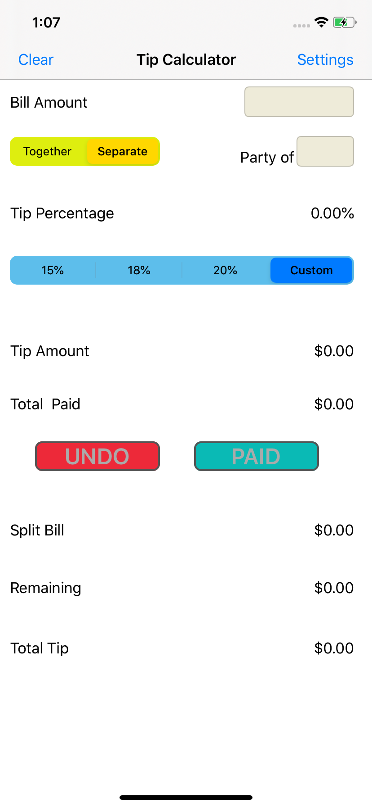
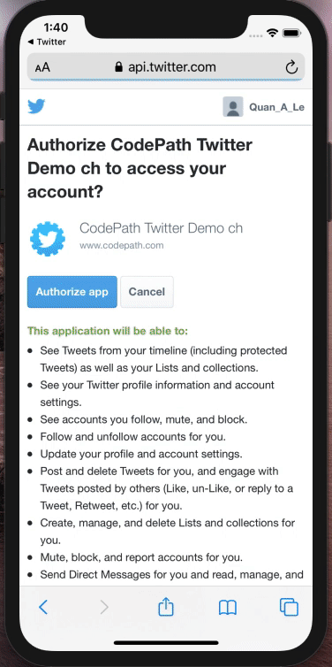

# iOS-Applications
Developed in Swift and XCode

### 1. [Tip Calculator](https://github.com/Quananhle/iOS-Applications/tree/main/Tip)

An app that calculate tip and total

<p float="left">
<a href="Tip/Pictures/Hnet-image.gif"></a>
<kbd><a href="Tip/Pictures/main_page.png"></a></kbd>
</p>

---

### 2. [Twitter](https://github.com/Quananhle/iOS-Applications/tree/main/Twitter)

An app that allows users to browse movies now playing in theaters.

<p float="left">
<a href="flixster/flixster.gif"></a>
</p>

---

### 3. [Flixster](https://github.com/Quananhle/iOS-Applications/tree/main/flixster)

Part of a Twitter app that allows users to log in to their actual Twitter accounts to view their timeline tweets. Using ```TwitterAPICaller``` to access the Twitter API and ```CocoaPods``` for frameworks

<p float="left">
<a href="Twitter/Twitter-part2.gif"></a>
</p>

---

### 4. [Parstagram](https://github.com/Quananhle/iOS-Applications/tree/main/Parstagram)

An instagram-like app that allows users to take and post pics. Using ```Alamofire``` library, ```MessageInputBar```, and ```Parse``` server custom backend database to store and retrieve user posts and ```back4app.com``` to host Parse dashboard

<p float="left">
<a href="Parstagram/Parstagram-part1.gif"></a>
<kbd><a href="Parstagram/Parstagram-part2.gif"></a></kbd>
</p>

---

### License

Copyright 2021 CSUMB

Licensed under the Apache License, Version 2.0 (the "License");
you may not use this file except in compliance with the License.
You may obtain a copy of the License at

http://www.apache.org/licenses/LICENSE-2.0

Unless required by applicable law or agreed to in writing, software
distributed under the License is distributed on an "AS IS" BASIS,
WITHOUT WARRANTIES OR CONDITIONS OF ANY KIND, either express or implied.
See the License for the specific language governing permissions and
limitations under the License.

⭐️ From [Quan](https://github.com/Quananhle) with :sparkling_heart: 


