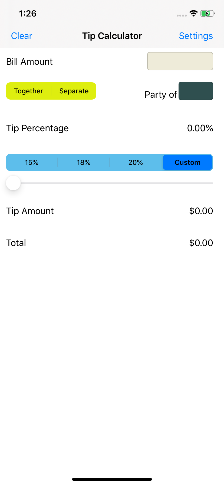
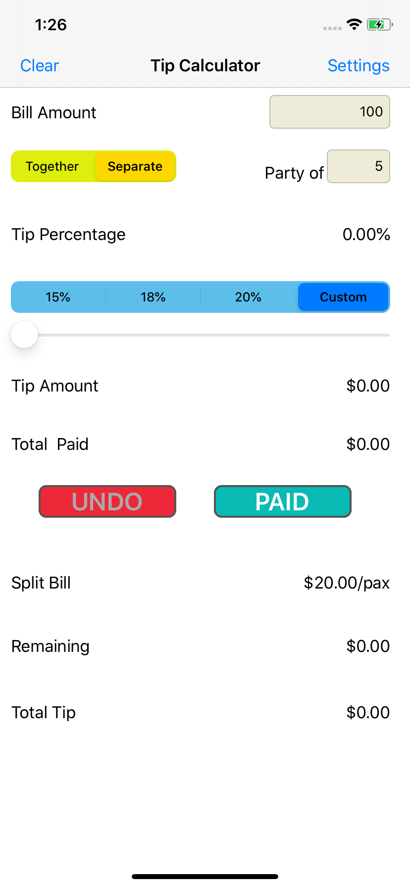
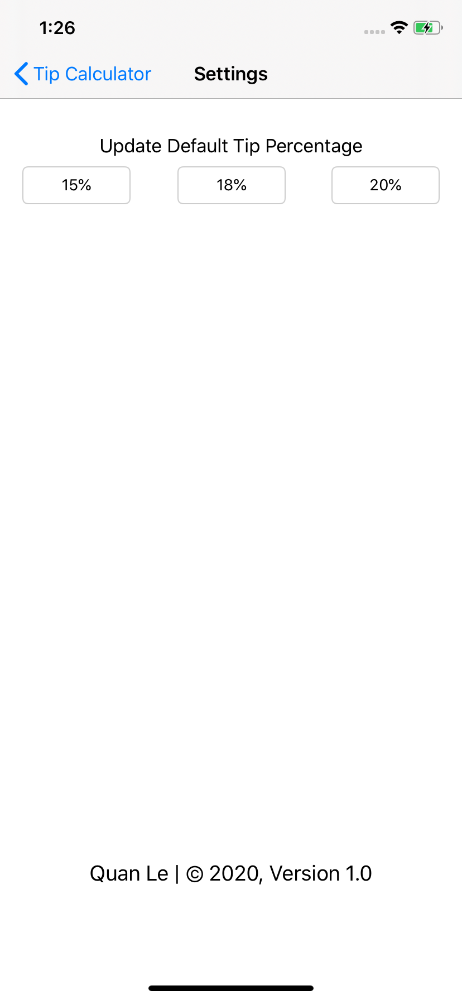

## Tip Calculator App

##### Published Date: 12/19/2020

<p float="left">
<a href="Pictures/Hnet-image.gif"></a>
<kbd><a href="Pictures/main_page.png"></a></kbd>
</p>

__Note__: App icon is from [icons8.com](https://icons8.com/icons/set/calculator)

### Application Flow Diagrams
 
* This app will calculate the tip amount from a bill amount based on the tip percentage chosen by the users.

* There are two main functions: ```Together``` to calculate the tip amount of the entire bill amount (scenario when a bill is paid in full by one person), and ```Separate``` to calculate tip amount from each person paying separately in a party and display the total tip amount, total paid.

* The left bar button ```Clear``` will reset all input and value to original

* The right bar button ```Settings``` allows users to update three default tip percentage and display __Author, Copyright data & Version)__

### Application Behavior Diagrams:

#### 1) Main Activity

<p float="center">
<kbd><a href="Pictures/main_page_1.png"></a></kbd>
<kbd><a href="Pictures/main_page_2.png"></a></kbd>
</p>

> 1. Enter bill amount
> 2. Select between ```Together``` or ```Separate```
> 3. 
>> Clicking on [Google Civic Information API](https://developers.google.com/civic-information/) shall navigate the user to the API website. Clicking on developer's name shall direct the user to the Github page [Quananhle](https://github.com/Quananhle) or the all logo shall direct the user to the Github page [KnowYourGovernment](https://github.com/Quananhle/OOP-and-Android-App-Development/tree/master/Android-App-Developer/App/KnowYourGovernment) where the source code of the application is published.
> 3. Opening the view of an individual official for details:


#### 2) Settings Activity

<kbd><a href="Pictures/settings_page.png"></a></kbd>
